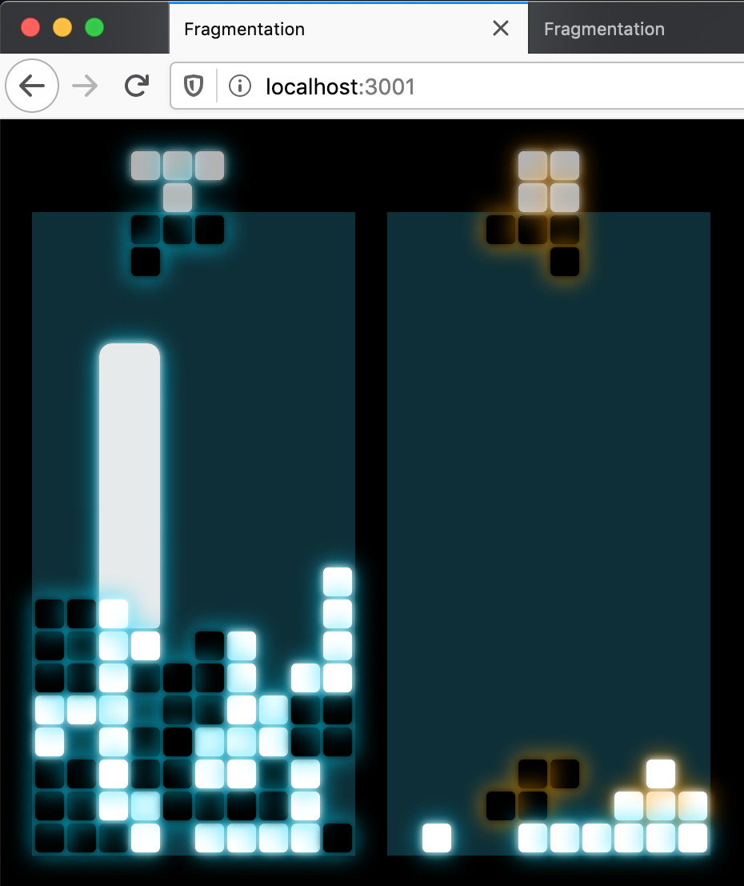

### Fragmentation

Multiplayer tetromino game inspired by Tron: Legacy that runs in a browser.
Play by sharing a link.

### Installation

Requires node v13.

    npm install

### Usage

Run the server.

    npm start

This also builds the project from src/*.coffee to lib/*.js using the CoffeeScript2 compiler.

    npm run dev

will automatically recompile files in src/ that have changed.

### Testing

Run the tests.

    npm test
